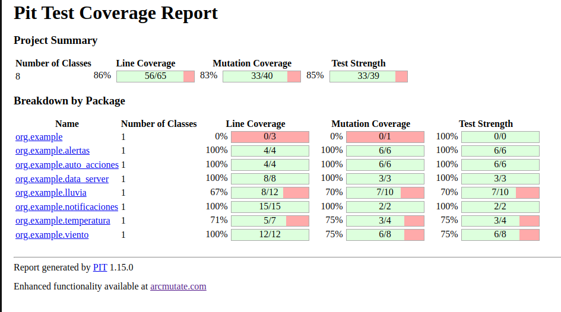

# Examen Final - CC3S2

## Actividades extra:

- https://github.com/pieropr2k/CC3S2-20241/tree/master/Part2/Actividad-Microservicios-DockerKubernetes
- https://github.com/pieropr2k/CC3S2-20241/tree/master/Part2/Actividad-PlayWithKubernetesLab
- https://github.com/pieropr2k/CC3S2-20241/tree/master/Part2/Actividad-PlayWithDockerLab/ForIT


## Primer Sprint: Estrategia de validación de pruebas, stubs y fakes (8 puntos)

Actividades
1. Diseño y implementación inicial:
- Diseñar las clases responsables de manejar las condiciones climáticas (Temperatura,
Lluvia, Viento).

Lluvia: depende de la humedad ya que a mayor humedad hay mayor cantidad de lluvia derramada.

Temperatura: clase que controla el valor de la temperatura e indica si es alta o no.

Viento: depende de la presion atmosferica ya que a mayor Presion Atmosferica hay menos oxigeno y esto hace que el viento sea mas lento.


- Implementar estas clases asegurando que cada una tenga una única
responsabilidad.

Clase Lluvia:


Clase Temperatura:


Clase Viento:


2. Desarrollo con TDD:
- Escribir pruebas unitarias para cada clase antes de implementar la funcionalidad.

Se puede apreciar que aqui en estas 3 clses estamos en fase RED:

Para Temperatura:


Para Lluvia:


Para Viento:


- Implementar la funcionalidad necesaria para que las pruebas pasen.

Para que las pruebas pasen se tiene que poner la logica correspondiente en los metodos:

Para Temperatura:


Para Lluvia:


Para Viento:


- Refactorizar el código después de que las pruebas pasen para mantenerlo limpio.

Esta son las pruebas que pasaron, no es necesario hacer una refactorizacion ya que tiene todo lo que se necesita:

Para Temperatura:


Para Lluvia:


Para Viento:


3. Validación de pruebas con stubs y fakes:


- Crear stubs para simular las condiciones climáticas

Del codigo mostrado en estas lineas se crean los stubs:

```java
	@Mock
    private Alertas alertasMock;
    @Mock
    private AutoAcciones autoAccionesMock;
    @InjectMocks
    private Notificaciones notificacionsMock;
	@Test
    public void notifyGoodAlertsTest() {
        // Configuramos los stubs:
        when(alertasMock.temperatureMessage(true)).thenReturn("Alerta de temperatura alta");
        when(alertasMock.rainMessage(true)).thenReturn("Alerta: Lluvia intensa");
        when(alertasMock.windMessage(true)).thenReturn("Alerta: Viento fuerte");
        // etc del codigo...
	}
	
	@Test
    public void notifyGoodActionsTest() {
    	// Configuramos los stubs:
        when(autoAccionesMock.temperatureMessage(true)).thenReturn("Poner bloqueador solar");
        when(autoAccionesMock.rainMessage(true)).thenReturn("Sistema de riego activado");
        when(autoAccionesMock.windMessage(true)).thenReturn("Persianas cerradas");
        // etc del codigo...
	}
```
Esto porque una vez creados los stubs los fakes van a poder pasar las pruebas, si no se implementan entonces tendremos errores.

- Implementar fakes para simular escenarios de prueba más complejos

Una vez creados los stubs en esta parte implementamos los fakes en la primera linea y luego los inyectamos al Mock. Como se ve en la imagen los fakes pasan las pruebas.

```java
	// Implementamos los fakes:
    private DataRepository dataFake = new DataServer(45, 0.6, 100);
    @Mock
    private Alertas alertasMock;
    @Mock
    private AutoAcciones autoAccionesMock;
    @InjectMocks
    private Notificaciones notificacionsMock;
    @Test
    public void notifyGoodAlerts() {
        // Configuramos los stubs previamente...

        // Injectamos el fake al mock:
        notificacionsMock = new Notificaciones(autoAccionesMock, alertasMock, dataFake);
        List<String> notificationsList = notificacionsMock.notifyAlerts();
        assertEquals(notificationsList.get(0), "Alerta de temperatura alta");
        assertEquals(notificationsList.get(1), "Alerta: Lluvia intensa");
        assertEquals(notificationsList.get(2), "Alerta: Viento fuerte");
    }

    @Test
    public void notifyGoodActions() {
        // Configuramos los stubs previamente...

        // Injectamos el fake al mock:
        notificacionsMock = new Notificaciones(autoAccionesMock, alertasMock, dataFake);
        List<String> notificationsList = notificacionsMock.notifyActions();
        assertEquals(notificationsList.get(0), "Poner bloqueador solar");
        assertEquals(notificationsList.get(1), "Sistema de riego activado");
        assertEquals(notificationsList.get(2), "Persianas cerradas");
    }
```

4. Refactorización y código limpio:
- Refactorizar el código regularmente para mejorar la legibilidad y mantenibilidad.

En Notificaciones lo que hicimos fue hacer una inyeccion de dependencias para que se puedan crear Stubs:


Las clases Alertas y AutAcciones en vez de que sean sus metodos tengan otros nombres diferentes (ejm: accionDeTempetatura() y alertaDeTemperatura()) para una mayor facilidad vamos a implementar la interfaz MessagesRepository a estas clases esto para que se tenga una mayor sencillez al invocar los metodos de los mensajes que den estas clases:


- Aplicar principios de diseño limpio y patrones de diseño adecuados.

5. Métricas de calidad:
- Utilizar herramientas para medir la cobertura de pruebas (Jacoco)


- Evaluar la complejidad del código utilizando métricas como la complejidad ciclomática.

Se puede ver que de la complejidad ciclomatica aqui el maximo es de 9 el cual lo tiene la clase Lluvia, esto debido a que depende del valor de la humedad y este valor es un valor que oscila entre 2 intervalos por lo que tiene mas casos de analisis y esto hace que la complejidad ciclomatica sea mayor.


## Segundo Sprint: Uso de docker y mejora de la estrategia de pruebas (12 puntos)

1. Contenerización del Sistema:
- Crear un Dockerfile para construir la imagen de la aplicación.

Aqui construimos la imagen, en este caso no use comando porque la UI de Intellij me permite correr mediante boton.


Aca corremos la imagen:


Aca se puede ver que nuestra imagen esta creada, como *sprint2-sistema-lluvia-service*


- Configurar un docker-compose.yml si se necesitan múltiples servicios (bases de
datos, servicios de simulación de clima).


2. Refinamiento del TDD:
- Escribir nuevas pruebas para cualquier funcionalidad adicional.
- Asegurar que todas las pruebas existentes pasen en el entorno Dockerizado.


3. Mejora de la estrategia de pruebas:
- Integrar las pruebas unitarias y de integración en el pipeline de Docker.
- Asegurar que los stubs y fakes funcionen correctamente en el entorno
contenerizado.

4. Refactorización y código limpio:
- Continuar refactorizando el código para mejorar la calidad y mantener la adherencia a los principios de diseño limpio.

5. Métricas de Calidad:
- Monitorear la cobertura de pruebas y la complejidad del código en el entorno Dockerizado.


- Utilizar herramientas de análisis de código para asegurar la calidad.

Usando pitest se puede ver que la cobertura es alta. Esto debido a los tests que se realizaron a lo largo del proyecto



